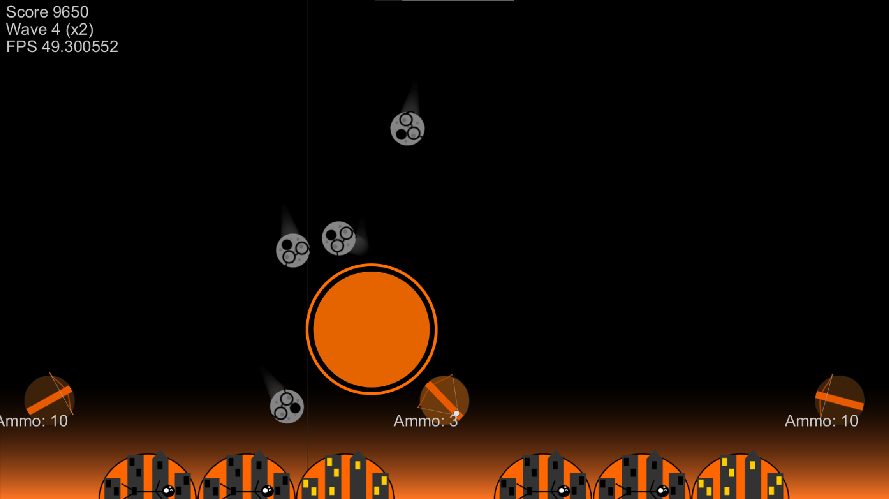

# CS4303 - Video Games

## Physics Practical: Ballista Command

###### Matric: 180010513

## Introduction

In this practical, we were required to implement a sequel to the classic Atari game "Missile Command". The game takes place on an Earth which has run out of missiles but has lots of bombs which are to be fired by the platyer at falling meteorites. The player cannot win the game, rather they instead attempt to protect their 6 cities for as long as possible.


## Design and Implementation

### Physics

I took a straightforward approach to the physics required in this practical. I decided the overhead of using force generators was not a worthwhile investment of resources given that only two forces are required by the basic specification.

I capture objects that will perform some kind of integration step using the `Physicsable` interface. This allows me to handle all objects that require integration in a single take using `gameObjects.filterIsInstance<Physicsable>.forEach { it.applyPhysics() }`. 

`Physicsable ` defines a default physics handler which integrates velocity over time first and then applies gravity and drag to the velocity vector.

###### Gravity

Gravity is a float in my game. I add it to the vertical position of `Physicsables` every update tick. I've assumed that all objects are much less massive than the Earth.

###### Drag

I've modelled drag as an acceleration opposing the velocity vector. This vector is proportional to the cross-sectional area of the moving object multiplied by the velocity squared. 
$$
\vec F_d = - k\rho A \cdot |\vec v| \cdot \vec{v}
$$
I've assumed a constant drag coefficient and air density which is of course not a valid assumption, but after a great deal of play-testing and tweaking numbers the game plays nicely so I decided not to worry. Figure 1 shows the effects of these forces on projectiles.


Figure 1: Distorted parabolic path followed by the bombs when aiming the right-hand ballista at the crosshair position shown.

###### Meteor Drop

I have taken a few liberties in assumptions when deciding the initial horizontal velocities of the meteors. My primary goal when choosing this speed was to make sure that a majority of meteors stay on-screen. This does not work perfectly because by equation ignores any initial y velocity and the impact of resistive forces. These assumptions were made at the very start of development when they help true. The current version of the game still does a fairly good job with the simpler maths so I chose not remodel the equations and focus my efforts elsewhere. The algorithm for choosing the meteor velocity picks a start location at (x=a, y=0), an end location at (x=b, y=Y_MAX) and uses the equations of motion under constant acceleration to calculate the initial speed required to get there. Ignoring drag, means that the system always undershoots. This means that the centre of the screen is unfortunately disproportionately focused. There still a decent distribution of meteor drop sites, sufficient to present a hopefully challenging and certainly losable game.

### Collisions

I have captured all classes objects over which collisions need to be handled using the `Collidable` interface. 

To avoid checking each `Collidable` against every other `Collidable`, I have enlisted the help of a quadtree, showcased in Figure 2 - a dynamically assigned grid which divides the screen into chunks of roughly equal object density. This gives average-case complexity of $nlogn$ to coarsely check for potential collisions between $n$ `Collidables`.

For this game, all `Collidables` just happen to be circles. On a finer grain to check for true collisions I simply check for the objects returned in the coarse collision search whether or not their centres are further apart than the sum of their radii.

`Collidables` implement a collision handler `onCollision(other: Collidable)` which typically looks something like this:

```
override fun onCollision(other: Collidable) {
        when (other) {
            is Explosion ->  {
                // add a new explosion, remove this meteor
                game.createExplosion(pos)
                game.removeObject(this)
                game.addPoints(score)
            }
        }
}
```

The handler function is called whenever an object fails the fine-grained collision test.


​	Figure 2: Quadtree visualisation with bounding boxes drawn in red. Note that these bounding boxes simply represent axis-aligned projections of the circular hitboxes

### Game features

###### state

I define the flow of the game via a very simple state machine implemented using a `GAMESTATE` `Enum`. This defines transitions between states as:

```
// a progression between states
    fun next() = when (this) {
        PREGAME -> PREWAVE
        PREWAVE -> WAVE
        WAVE -> ENDWAVE
        ENDWAVE -> PREWAVE
        GAMEOVER -> PREGAME
    }
```

The state can be short-circuited from the WAVE state to the GAMEOVER state by the GameManager when end-of-game is detected.

###### graphics

I have hand-sprited the all of art for Ballista Command using Inkscape. There are various in-game graphical cues such as simple animations for the ballistae firing, and different sprites for dead cities and ballistae. The background 'atmosphere' gradient becomes more orange as cities die. I added this increasingly apocalyptic sky to give a greater sense of urgency as the game progresses. 

The meteors spin gently as they fall, in the same direction as they are falling. This makes them look as though tumbling towards Earth down an invisible parabolic hill. The meteors have faint trails, created by storing previously passed-through locations in a queue.

The explosions are translucent, deep orange circles which become yellower as they expand. I found the final art style to be simple yet effective.

###### sound

I created all of the beeps, white noise and music for my game. The background music is an 8-bit short snippet from 'Haitian Fight Song' by Charles Mingus, synthesised using the NES music tracker FamiTracker. The voicelines ("Screaming", "Oh no", "A new wave approaches") were originally placeholder files, but I really liked them in the end, they're quite fun. These were created using a slightly suspect [text-to-speech API](https://github.com/weespin/WillFromAfarDownloader). I was originally using the Processing Sound library, and panned the explosions left and right based on screen position. However, I ran into significant issues with that library so moved my codebase to use Minim. Sadly this means that the explosions are no longer panned, but the overall sound experience is improved.

###### waves

Play proceeds in waves. The wave number is a parameter which controls aspects of the game such as:

- the scoring multiplier
- the enemies that are permitted to spawn
- the number of meteors that will spawn
- the speed at which meteors are initially fired down

Meteors have a chance to spawn randomly every game update tick, until the wave is over. A wave ends once its meteors have all been spawned and destroyed. As the waves progress the WaveManager has a chance to spawn different enemies alongside the standard meteors. Each of the meteors dropped by a bomber/satellite, and the smart meteors count towards the wave's meteor quota. 

I added a (skippable) wave-end screen to render the score bonuses after each wave. 

###### splitting

From wave 2, the (non-smart) meteorites can split in two on their way down (up until the point that they reach the vertical halfway line on-screen). Limiting their ability to split based on vertical position made the game feel fairer, since meteorites are required to give at least some notice before taking out multiple cities. Splitting in my game aimed to act as if conserving momentum, that is the net velocity change is always zero. Of course, this conveniently ignores that we've doubled the mass of our system using mysterious cosmic energy... Figure 3 shows a pair of meteorites which split from a single parent.


Figure 3: The bottom-rightmost meteorites in the image split from a single parent meteor.

###### object pool

I originally ran into performance issues at higher meteor spawn rates. Upon closer investigation it became clear that the cost of object-creation was hindering the game's ability to produce large chains of explosions. This led me to create an `ExplosionPool` which we can borrow objects from and return objects to. This is only a wrapper around an array-based queue but improved performance quite considerably.

###### satellites/bombers (these are equivalent in my game but for colour)

From wave 2, Satellites are little colourful blobs that have a fixed-height patrol of the screen, dropping bombs randomly with a frequency distribution centred around a drop rate of roughly 2Hz.

Satellites are perhaps my least favourite aspect of my game. By the later waves they can drop meteors unfairly quickly. If I had more time I'd like to balance the satellites perhaps by using a log function rather than a linear of the wavenumber to determine drop speed. Arguably a current problem, is that in later waves the meteors can be forced down beyond their terminal velocity. This isn't necessarily a bad thing, as it could be that the meteors were travelling much faster in space than they are now able to in the atmosphere, it just felt a little odd in-game.

###### smart meteor

From wave 6, smart meteors can spawn. I decided that these should **not** be affected by gravity and drag when 'engaged' - they are so smart that even physics stops for them. Smart meteors each have two 'engaged' modes:

1. They are locked onto a city
2. They are avoiding an explosion

When they are not engaged they will act as though normal meteors (although they *cannot* split).

Smart meteors have a fixed, conical field of view of 90 degrees, which points straight downwards regardless of meteor orientation (orientation is a property used only by the renderer). If they can 'see' a city within this FOV range they will target it and bee-line for the city **at a fixed speed**. This gives the player a chance against them in later waves.

If a smart meteor meets the edge of an explosion's radius it will follow a tangential path downwards along the near-edge of the explosion, with radial velocity equal to the blast speed of the explosion. This ensures that they will not be able to crash into a single explosion. Naturally the weakness of smart meteors is that you can destroy them easily by detonating the bomb as it passes over the smart meteor.

Figure 4 showcases smart meteor behaviour.

A fun bug I found but decided to to leave in the the game occurs when you detonate a bomb directly above a smart meteor. The smart meteor becomes stun locked horizontally before being launched out on a tangent if no cities are in sight. 



*Figure 4: Smart Meteorites converging on a target while avoiding the explosion during a test wave.*


## Conclusion

This practical has been a great deal of fun. I believe that I have implemented all required functionality. The game itself, though simple, presents a fun little timewasting activity. I do wish I could have spent longer on the sound to build a more sophisticated audio system. I am now much more comfortable using processing and have enjoyed writing Kotlin code. 


